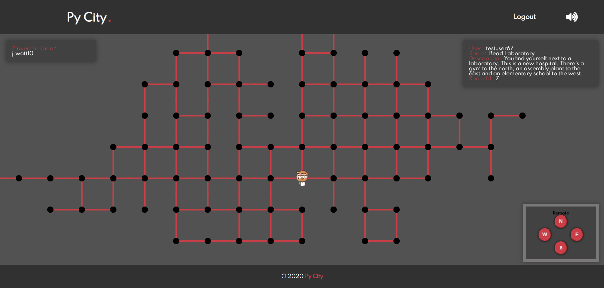

# [PyCity](pycity.netlify.app)

Explore a procedurally generated city, and interact with other players in it! Built in 1 week with a team of 5 web developers.

## My Contribution
Contributed to the project as a front end developer using Javascript, React, Redux, HTML and CSS. Specifically worked on rendering the game using HTML5 Canvas, with fancy animations too!
